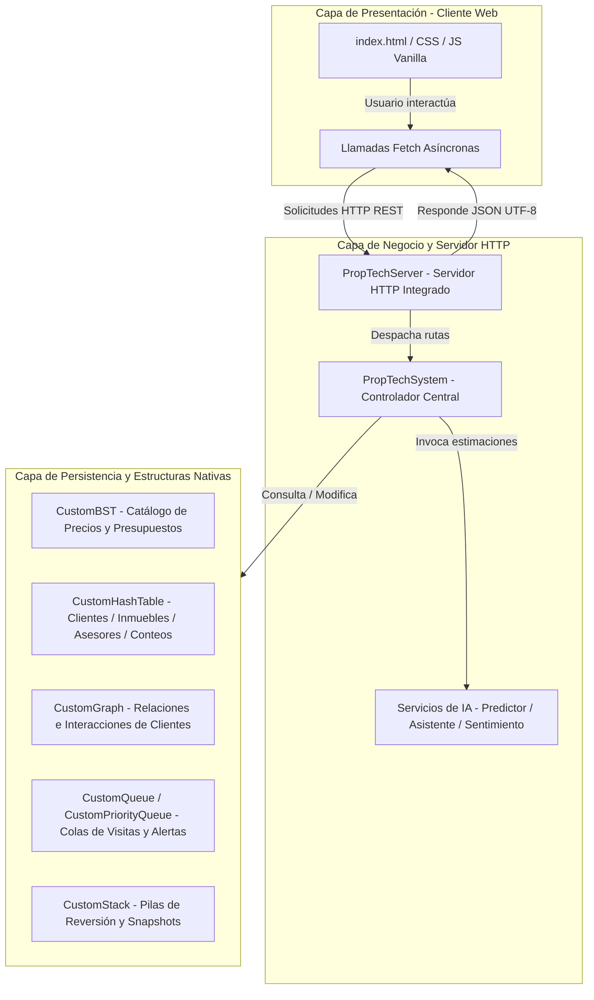

# Documento de Sustentación Técnica: Plataforma PropTech

Este documento describe la arquitectura, el diseño y el cumplimiento detallado de los requerimientos técnicos y funcionales para el **Proyecto Final de Estructuras de Datos (2026-1): Plataforma PropTech para Gestión Inteligente de Inmuebles, Clientes y Operaciones**.

---

## 1. Arquitectura del Sistema y Flujo de Datos

El sistema está diseñado bajo una arquitectura cliente-servidor desacoplada para garantizar modularidad y rendimiento:

---

## 2. Justificación Técnica y Mapeo de Estructuras de Datos (Sección 5)

Todas las estructuras de datos fueron implementadas **desde cero** (sin depender del framework de colecciones de Java) en el paquete [structures](./src/structures). A continuación, se detalla su uso y su justificación algorítmica:

| Estructura | Archivo de Código | Complejidad | Propósito y Justificación Técnica en el Contexto Inmobiliario |
| :--- | :--- | :--- | :--- |
| **Listas** | [CustomList.java](./src/structures/CustomList.java) | Búsqueda: $O(n)$ Inserción: $O(1)$ | **Historiales y Colecciones Dinámicas:** Utilizada para almacenar el historial de visitas agendadas, los inmuebles consultados, los favoritos por cliente y los inmuebles asignados a un asesor, donde el tamaño es variable e indeterminado. |
| **Pilas** | [CustomStack.java](./src/structures/CustomStack.java) | Inserción/Borrado: $O(1)$ | **Reversión y Snapshots (Control+Z):** Utilizada para almacenar el historial de acciones del administrador (`historialAdministrativo`) y capturar instantáneas de estados de inmuebles (`pilaSnapshotsInmueble`) antes de un cambio de precio o estado, permitiendo deshacer cambios con comportamiento LIFO. |
| **Colas** | [CustomQueue.java](./src/structures/CustomQueue.java) | Encolar/Desencolar: $O(1)$ | **Gestión de Flujos de Trabajo (FIFO):** Implementada para procesar en orden de llegada las solicitudes de atención de clientes (`colaSolicitudesClientes`), las tareas administrativas internas y las visitas pendientes de confirmación asignadas a cada asesor. |
| **Colas de Prioridad** | [CustomPriorityQueue.java](./src/structures/CustomPriorityQueue.java) | Encolar: $O(n)$ o $O(\log n)$ Desencolar: $O(1)$ | **Atención Diferenciada y Urgencias:** Utilizada para organizar las visitas de clientes VIP o urgentes, priorizar las alertas de contratos de arriendo próximos a vencer (`colaContratosPorVencer`) y clasificar a los clientes según su nivel de probabilidad de cierre. |
| **Tablas Hash** | [CustomHashTable.java](./src/structures/CustomHashTable.java) | Búsqueda/Inserción: $O(1)$ promedio | **Búsquedas Rápidas y Agrupación:** Permite la indexación y búsqueda instantánea de clientes por identificación (`tablaClientes`), inmuebles por código (`tablaInmueblesRapida`) y asesores por ID. También realiza conteos de visitas e intereses agrupados por zona o tipo de propiedad. |
| **Árboles** | [CustomBST.java](./src/structures/CustomBST.java) | Búsqueda/Rango: $O(\log n)$ promedio | **Ordenamiento y Consultas de Rango:** Árbol Binario de Búsqueda que mantiene los inmuebles ordenados por precio, lo que permite realizar consultas eficientes de propiedades dentro de un presupuesto específico y listar asesores según su volumen de cierres. |
| **Grafos** | [CustomGraph.java](./src/structures/CustomGraph.java) | BFS: $O(V + E)$ | **Análisis de Relaciones Comerciales:** Grafo bidireccional que conecta clientes con propiedades que visitan o guardan en favoritos. Se utiliza para generar recomendaciones automáticas colaborativas y calcular la movilidad comercial (grado de conexión y BFS). |

---

## 3. Mapeo de Requisitos Funcionales (Sección 6)

El sistema satisface al 100% las funcionalidades requeridas. A continuación se referencia el fragmento exacto de código en el backend que implementa cada una:

### R1. Gestión de Inmuebles (Registrar, Modificar, Eliminar y Consultar)
* **Archivo:** [PropTechSystem.java](./src/controllers/PropTechSystem.java)
* **Métodos:**
  * Inserción y Modificación: `registrarInmueble()` (Inserta eficientemente en la tabla hash rápida y en el árbol BST).
  * Eliminación: `eliminarInmueble()`.
  * Búsqueda Directa: `buscarInmueble()` (Búsqueda en $O(1)$).

### R2. Gestión de Clientes (Registrar, Modificar, Eliminar y Consultar)
* **Archivo:** [PropTechSystem.java](./src/controllers/PropTechSystem.java)
* **Métodos:**
  * Inserción: `registrarCliente()`.
  * Búsqueda por ID: `buscarCliente()`.
* **Modelo:** [Cliente.java](./src/models/Cliente.java) almacena datos del perfil y preferencias.

### R3. Gestión de Asesores (Registrar, Modificar y Consultar)
* **Archivo:** [PropTechSystem.java](./src/controllers/PropTechSystem.java)
* **Métodos:**
  * Registro: `registrarAsesor()` (Añade a la tabla hash e indexa en el BST de rendimiento).
  * Consulta: `buscarAsesor()`.

### R4. Programación, Reprogramación y Cancelación de Visitas
* **Archivo:** [PropTechSystem.java](./src/controllers/PropTechSystem.java)
* **Métodos:**
  * Agendar: `agendarVisita()` (Verifica consistencia horaria, estado "Disponible" y prioridad).
  * Reprogramar: `reprogramarVisita()`.
  * Cancelar: `cancelarVisita()`.

### R5. Registro de Favoritos e Historial de Interacción del Cliente
* **Archivo:** [Cliente.java](./src/models/Cliente.java)
* **Métodos:**
  * Favoritos: `agregarFavorito()` y `removerFavorito()`.
  * Historial LIFO: `registrarInteraccion()` (Guarda en la pila `historialInteracciones`).

### R6. Registrar Operaciones de Arriendo, Venta y Renovación
* **Archivo:** [PropTechSystem.java](./src/controllers/PropTechSystem.java)
* **Métodos:**
  * Registro y Comisiones: `registrarOperacion()` (Actualiza estados de disponibilidad de inmuebles y asigna cierres a los asesores).
  * Renovación de Contrato: `renovarContrato()`.

### R7. Generar Alertas Automáticas
* **Archivo:** [PropTechSystem.java](./src/controllers/PropTechSystem.java)
* **Método:** `generarAlertasSistema()` escanea el catálogo, solicitudes y visitas y devuelve un listado de alertas de criticidad operativa en tiempo real.

### R8. Recomendación de Inmuebles según Preferencias
* **Archivo:** [PropTechSystem.java](./src/controllers/PropTechSystem.java)
* **Método:** `obtenerRecomendacionesHibridas()`. Este motor combina los filtros de coincidencia de [Cliente.java](./src/models/Cliente.java) (`cumplePresupuesto && cumpleZona && cumpleTipo && estaDisponible && cumpleHabitaciones`) con las sugerencias de vecinos en el grafo y el historial de consultas del cliente.

### R9. Detectar Comportamientos Comerciales Inusuales
* **Archivo:** [UnusualBehaviorDetectionModule.java](./src/controllers/UnusualBehaviorDetectionModule.java)
* **Método:** `runDetection()`. Detecta inmuebles sobre-visitados sin concretar arriendo/venta, clientes compulsivos de visitas sin cierres, asesores con visitas pendientes atípicas, especulación por múltiples cambios de precio y anomalías de concentración geográfica.

### R10. Consultar Reportes por Zona, Precio, Visitas y Cierres
* **Archivo:** [PropTechServer.java](./src/controllers/PropTechServer.java)
* **Método:** `ReportesHandler`. Consolida los datos del inventario y visitas agregadas y los formatea como respuesta JSON para ser graficada por la interfaz.

### R11. Ordenar Inmuebles por Criterios
* **Archivo:** [PropTechSystem.java](./src/controllers/PropTechSystem.java)
* **Métodos:**
  * Ordenamiento nativo por Árbol BST: `obtenerCatalogoLista()` (Obtiene la lista ordenada por recorrido In-Order en $O(n)$).
  * Ordenamiento en memoria por precio: `obtenerRecomendacionesManuales()` ordena los inmuebles filtrados utilizando el algoritmo de ordenamiento burbuja nativo.

### R12. Consultar Relaciones entre Clientes e Inmuebles
* **Archivo:** [CustomGraph.java](./src/structures/CustomGraph.java)
* **Métodos:** `bfsTraversal()` y `getRecommendations()` analizan de manera estructural las relaciones y dependencias directas e indirectas entre entidades.

---

## 4. Requisitos Adicionales (Sección 8)

> [!NOTE]
> Todos los requerimientos especiales y módulos de inteligencia analítica fueron implementados a nivel lógico.

1. **Recomendación de inmuebles similares a uno consultado:** Implementado en el motor de grafos `getRecommendations` en [CustomGraph.java](./src/structures/CustomGraph.java).
2. **Ranking de zonas con mayor actividad:** Implementado en `obtenerRankingZonasActividad()` en [PropTechSystem.java](./src/controllers/PropTechSystem.java).
3. **Ranking de asesores por efectividad:** Implementado en `obtenerRankingAsesoresEfectividad()` en [PropTechSystem.java](./src/controllers/PropTechSystem.java).
4. **Detección de clientes con alta probabilidad de cierre:** Implementado en `obtenerClientesAltaProbabilidad()` en [PropTechSystem.java](./src/controllers/PropTechSystem.java).
5. **Consulta por múltiples filtros combinados:** Implementado en `filtrarInmueblesAvanzado()` en [PropTechSystem.java](./src/controllers/PropTechSystem.java).
6. **Análisis de relaciones entre inmuebles visitados por clientes similares:** Realizado con el análisis del grafo en [CustomGraph.java](./src/structures/CustomGraph.java).
7. **Simulación de crecimiento de demanda por sector:** Implementado en `simularCrecimientoDemanda()` en [PropTechSystem.java](./src/controllers/PropTechSystem.java).

---

## 5. Requisitos No Funcionales (Sección 7)

> [!IMPORTANT]
> - **Organización en Clases:** El proyecto sigue el estándar de paquetes (`models`, `controllers`, `structures`, `servicios_ia`).
> - **Validaciones de Negocio:** La agenda de visitas valida que la fecha no sea del pasado, que el inmueble esté disponible y que no haya cruces de horarios.
> - **Manejo de Errores:** Bloques `try-catch` robustos en el servidor y controladores protegen contra entradas malformadas.
> - **Interfaz Gráfica Modernizada:** La aplicación web es dinámica, interactiva y con diseño moderno (modo oscuro opcional, alertas y gráficas fluidas).

---

## 6. Pruebas y Validación Operativa

Para demostrar el correcto funcionamiento del sistema, puedes iniciar el servidor y navegar a la interfaz:

1. **Compilar y Levantar el Servidor:** Ejecutar la clase principal [MainWeb.java](./src/MainWeb.java) desde la consola o tu IDE. Esto precargará un set completo de datos iniciales en memoria (clientes, asesores, inmuebles e historial de cierres) y publicará el servicio.
2. **Acceso Web:** Abrir el navegador en `http://localhost:8082`.
3. **Roles de Prueba Integrados:**
   * **Administrador:** Usuario `admin`, Contraseña `admin123` (Accede a tableros de auditoría de anomalías, deshecho de acciones administrativas en pila, simulación de demanda sectorial y rankings).
   * **Asesor:** ID `A-001`, Contraseña `123` (Accede a la cola de visitas asignadas y registro de cierres).
   * **Cliente:** ID `C-01` (Accede al recomendador híbrido, lista de favoritos e historial).
