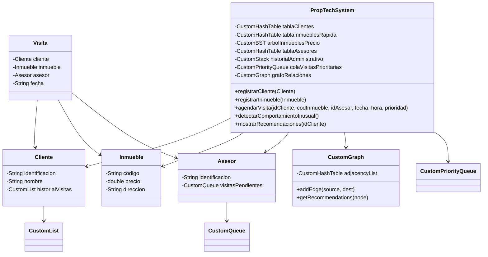

# 📊 Diagrama de Clases - Sistema PropTech

Este diagrama representa la arquitectura del sistema, mostrando la relación entre los modelos, el controlador y las estructuras de datos personalizadas.

```mermaid
classDiagram
    class PropTechSystem {
        -CustomHashTable tablaClientes
        -CustomHashTable tablaInmueblesRapida
        -CustomBST arbolInmueblesPrecio
        -CustomHashTable tablaAsesores
        -CustomStack historialAdministrativo
        -CustomPriorityQueue colaVisitasPrioritarias
        -CustomGraph grafoRelaciones
        +registrarCliente(Cliente)
        +registrarInmueble(Inmueble)
        +agendarVisita(idCliente, codInmueble, idAsesor, fecha, hora, prioridad)
        +detectarComportamientoInusual()
        +mostrarRecomendaciones(idCliente)
    }

    class Cliente {
        -String identificacion
        -String nombre
        -CustomList historialVisitas
    }

    class Inmueble {
        -String codigo
        -double precio
        -String direccion
    }

    class Asesor {
        -String identificacion
        -CustomQueue visitasPendientes
    }

    class Visita {
        -Cliente cliente
        -Inmueble inmueble
        -Asesor asesor
        -String fecha
    }

    class CustomGraph {
        -CustomHashTable adjacencyList
        +addEdge(source, dest)
        +getRecommendations(node)
    }

    PropTechSystem --> Cliente
    PropTechSystem --> Inmueble
    PropTechSystem --> Asesor
    PropTechSystem --> CustomGraph
    PropTechSystem --> CustomPriorityQueue
    
    Visita --> Cliente
    Visita --> Inmueble
    Visita --> Asesor
    
    Asesor --> CustomQueue
    Cliente --> CustomList
```
