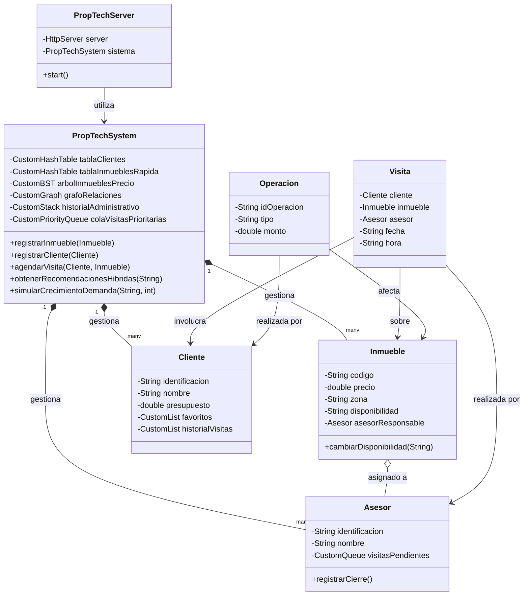

# Diagrama de Clases - PropTech System

## Relación con Estructuras de Datos
- **Inmueble/Cliente/Asesor:** Almacenados en `CustomHashTable` para búsquedas O(1).
- **Catálogo de Precios:** Gestionado por `CustomBST` para búsquedas por rango.
- **Flujo de Visitas:** `CustomQueue` y `CustomPriorityQueue` para atención y prioridad VIP.
- **Relaciones de Mercado:** `CustomGraph` para analizar conexiones entre usuarios y propiedades.
